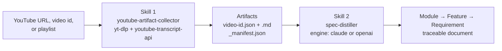
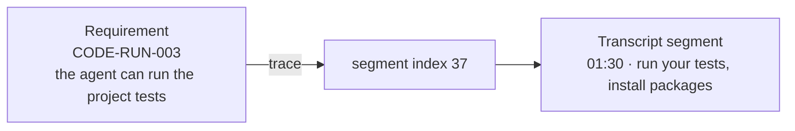

# youtube-to-spec

Turn YouTube videos into structured, LLM-ready knowledge.

## What it does, in one line

A YouTube video (or a whole playlist) goes **in**; a structured **requirements document** comes
**out** — and every line in that document is traceable back to the exact second of the video it came
from.

You never lose the source. If a requirement says *"the agent can run your tests,"* you can click
straight to the moment in the transcript where the video said it.



## The two skills at a glance

The project is two small, independent skills. The first **produces** artifacts; the second
**consumes** them. They are coupled by exactly one thing: a versioned JSON contract
(`schema_version`).

| Skill | Takes in | Produces |
| ----- | -------- | -------- |
| **1 · `youtube-artifact-collector`** (production) | A YouTube URL, bare video id, or playlist | Lossless per-video `JSON` + readable `Markdown`, plus a `_manifest.json` for playlists |
| **2 · `spec-distiller`** (consumption) | A Skill 1 artifact (or a whole collection) | A **Module → Feature → Requirement** document, every requirement traced to a transcript segment |

Because they are decoupled, you can swap the *analysis* (requirements, product discovery, business
rules, a different doc style) purely by editing external prompt files — no code changes.

> **Running example.** Everything below is a real run of the short, public, captioned video
> [**"What is Claude Code?"**](https://www.youtube.com/watch?v=fl1DSmwQKKY) (`fl1DSmwQKKY`) — collect
> its artifact, then distill requirements from it.

---

## What a real run produces

**Step 1 — collect.** Skill 1 fetches metadata and a timestamped, segment-structured transcript.
A slice of the real transcript artifact for this video looks like this:

```
[00:08] (segment 2)   edits your files, run commands, and
[01:28] (segment 36)  code. Claude Code can execute your build
[01:30] (segment 37)  script, run your tests, install
```

Every segment carries a stable, zero-based `index` — that index is the **address** the next step
points back to.

**Step 2 — distil.** Skill 2 reads that artifact and produces the requirements document below (this
is the actual generated output, trimmed for length). Each requirement has a stable id
`<MODULE>-<FEATURE>-<NNN>` and a `trace` back to a real transcript segment:

```
CODE - EDIT - 001
 │      │      └── requirement number (video-local, starts at 001)
 │      └───────── feature  (an action, e.g. READ / EDIT / RUN)
 └──────────────── module   (here: "Claude Code")
```

```markdown
### CODE — Claude Code

#### READ — Understand the codebase

- **CODE-READ-001**: The agent understands the user's codebase directly, using it as context instead
  of requiring code to be copied and pasted in. _(trace: timestamp 00:06, segment 1)_
- **CODE-READ-002**: The user can ask the agent to explain a feature in the codebase.
  _(trace: timestamp 01:25, segment 34)_
- **CODE-READ-003**: The user can ask the agent to trace a bug throughout the code.
  _(trace: timestamp 01:26, segment 35)_

#### EDIT — Edit files

- **CODE-EDIT-001**: The agent edits the user's files directly in place, rather than returning code
  for the user to paste back and forth. _(trace: timestamp 00:08, segment 2)_
- **CODE-EDIT-002**: The agent performs the work itself across the codebase to complete a defined
  goal. _(trace: timestamp 00:49, segment 19)_

#### RUN — Run commands

- **CODE-RUN-001**: The agent runs commands in the user's terminal. _(trace: timestamp 00:08, segment 2)_
- **CODE-RUN-002**: The agent can execute the project's build script. _(trace: timestamp 01:28, segment 36)_
- **CODE-RUN-003**: The agent can run the project's tests. _(trace: timestamp 01:30, segment 37)_
- **CODE-RUN-004**: The agent can install packages. _(trace: timestamp 01:33, segment 38)_
- **CODE-RUN-005**: The agent uses command output to decide what to do next.
  _(trace: timestamp 01:35, segment 39)_

#### SRCH-WEB — Search the web

- **CODE-SRCH-WEB-001**: The agent can search the web to fetch documentation, such as the latest API
  references. _(trace: timestamp 01:37, segment 40)_

#### INTEG — Integrate external tools

- **CODE-INTEG-001**: The agent integrates with the user's existing developer tools.
  _(trace: timestamp 00:10, segment 3)_
- **CODE-INTEG-002**: The agent connects to external tools and services to help complete a goal.
  _(trace: timestamp 02:41, segment 68)_

#### PERM — Permission & control

- **CODE-PERM-001**: By default, the agent asks for permission before running commands or making
  changes to the codebase. _(trace: timestamp 02:10, segment 55)_
- **CODE-PERM-002**: The user stays in control and can work in a more hands-on or more passive way.
  _(trace: timestamp 02:14, segment 57)_

#### ACCESS — Availability

- **CODE-ACCESS-001**: Claude Code is available in the terminal, VS Code, the Claude desktop app, the
  web, and JetBrains IDEs. _(trace: timestamp 00:19, segment 6)_
```

### How the trace works

The `trace` on every requirement is not decoration — it is a resolvable pointer. The segment index is
the stable address; follow it back to the exact transcript segment and timestamp:



This is what makes the output *auditable*: a reviewer can verify every requirement against its source
instead of trusting a summary.

---

## Why it's built this way

- **Production ≠ consumption.** The collector never analyses; it produces high-fidelity artifacts.
  Any number of downstream LLM tasks can consume them. Success is measured by artifact quality and
  relational integrity, not by one consumer.
- **Lossless & addressable.** Transcript text is reproduced byte-for-byte; every segment carries a
  stable zero-based `index` (`start`/`duration`/`end`/`text`) so future visual/derived artifacts can
  reference it.
- **Relationships preserved.** Playlists become a `_manifest.json` that records ordered membership,
  per-member status, and a summary — private/deleted/unavailable videos are listed with a reason,
  **never silently dropped** (graceful degradation).
- **Prompt-swappable analysis.** Prompts and templates live in external files and are read at
  runtime, so switching the analysis task requires zero code edits.
- **Built with blind-TDD.** Every unit was implemented by an agent that never saw its tests, from a
  written behavioral spec — implementation was never fit to assertions. 239 offline unit tests.

---

## Repository layout

```
youtube-to-spec/
├── skills/
│   ├── youtube-artifact-collector/     # Skill 1 — production (yt-dlp + youtube-transcript-api)
│   │   ├── SKILL.md
│   │   ├── scripts/extract_artifacts.py
│   │   └── tests/                       # offline unit tier
│   └── spec-distiller/                 # Skill 2 — consumption (Claude-native or OpenAI)
│       ├── SKILL.md
│       ├── scripts/extract_requirements.py
│       ├── prompts/  templates/  .env.example
│       └── tests/
├── tests/integration/                  # opt-in, real network / OpenAI (skipped by default)
└── docs/                               # product brief, roadmap, authoritative plan, specs
```

Everything runs on **[uv](https://docs.astral.sh/uv/)** via inline PEP-723 scripts — no
`pyproject.toml`, no build step. Each script declares its own dependencies in a header.

---

## Skill 1 — `youtube-artifact-collector` (production)

Collect rich metadata **and** timestamped, segment-structured transcripts for one video, several
videos, or an entire playlist, into lossless per-video `JSON` + readable `Markdown`.

```bash
# Single video → data/_singles/fl1DSmwQKKY.json + .md
uv run skills/youtube-artifact-collector/scripts/extract_artifacts.py \
  "https://www.youtube.com/watch?v=fl1DSmwQKKY"

# A bare 11-char id works too, and so does a whole playlist
uv run skills/youtube-artifact-collector/scripts/extract_artifacts.py fl1DSmwQKKY
uv run skills/youtube-artifact-collector/scripts/extract_artifacts.py \
  "https://www.youtube.com/playlist?list=PL..." --playlist

# Inspect a video without writing files
uv run skills/youtube-artifact-collector/scripts/extract_artifacts.py fl1DSmwQKKY --print
```

Key flags: `--playlist`, `--langs tr,en`, `--metadata-only`, `--skip-existing`, `--format json|md|both`,
`--root DIR`. See the skill's [`SKILL.md`](skills/youtube-artifact-collector/SKILL.md).

---

## Skill 2 — `spec-distiller` (consumption)

Turn a Skill 1 artifact (or a whole collection) into the **Module → Feature → Requirement** document
shown above. Two interchangeable engines emit the **same** shape:

- **`claude` (default, offline, no API key)** — Claude reads the artifact + external prompt/template
  files and produces the document in-chat. (This is how the example above was generated.)
- **`openai`** — runs the script against the OpenAI API with `json_schema` structured output.

```bash
# OpenAI engine (needs OPENAI_API_KEY in .env — see skills/spec-distiller/.env.example)
uv run skills/spec-distiller/scripts/extract_requirements.py \
  data/_singles/fl1DSmwQKKY.json --engine openai --print
```

Config precedence is **CLI flag > env var > built-in default**. See
[`SKILL.md`](skills/spec-distiller/SKILL.md).

---

## Testing

```bash
# Offline unit tier (deterministic, no network) — invoke per skill
uv run --with pytest pytest skills/youtube-artifact-collector/tests/     # 122 tests
uv run --with pytest pytest skills/spec-distiller/tests/                 # 125 tests

# Opt-in integration tier — real network / OpenAI; skipped unless explicitly enabled
RUN_INTEGRATION=1 uv run --with pytest --with openai --with python-dotenv \
  pytest tests/integration -m integration
```

The integration tests self-skip when `RUN_INTEGRATION` is unset or the resource (network /
`OPENAI_API_KEY`) is unavailable, so normal runs stay fast, free, and offline.

---

## Tech & design

- **Python** + **uv** PEP-723 inline scripts · **yt-dlp** · **youtube-transcript-api** · **OpenAI**
- Decoupled production/consumption layers · lossless, segment-indexed artifacts · graceful
  degradation · external swappable prompts · structured (`json_schema`) output · blind-TDD

More context in [`docs/`](docs/): the product brief, roadmap, the authoritative implementation plan,
and the per-component behavioral specs.
