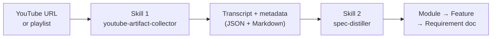
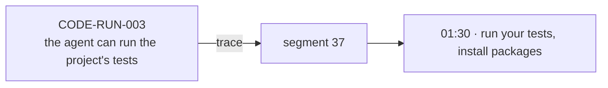

# youtube-to-spec

Turn YouTube videos into traceable software requirement specs.

Give it a video (or a whole playlist). It extracts the transcript, then turns what was said into a structured **Module → Feature → Requirement** document — where every requirement links back to the exact timestamp it came from.



---

## When to use it

Any time knowledge is trapped in video and you need it in a structured, reviewable form:

- **Product & feature documentation** — turn product demo or walkthrough videos into a requirements doc your team can review, prioritize, and track.
- **Reverse-engineering a legacy system** — if the only documentation is tutorial videos, run them through the pipeline to extract what the system actually does.
- **User research synthesis** — record user interview or usability test sessions, upload to YouTube (unlisted), then distil them into feature requests with timestamps pointing to the exact moment the user said it.
- **Onboarding knowledge base** — convert a playlist of onboarding or training videos into a structured reference document new team members can search.
- **Competitive analysis** — run competitor product demo videos through the pipeline to get a structured feature list you can compare against your own backlog.
- **Conference & webinar notes** — distil a talk or panel into a Module→Feature→Requirement structure, so key points are addressable rather than buried in a recording.
- **QA & test scenario extraction** — extract what behaviors a demo video shows; use the output as a starting point for test cases, each linked to the source moment.

The pipeline doesn't care about domain — swap the prompt files in `skills/spec-distiller/prompts/` and the output adapts to your terminology.

---

## The two skills

**Skill 1 — `youtube-artifact-collector`**
- Downloads video metadata and the full transcript from a YouTube URL, video id, or playlist
- Saves a lossless `.json` artifact and a readable `.md` file per video, named after the video's
  title — playlist members keep their position (`01-tek-tek-ogrenci-yukleme.json`)
- For playlists: produces a `_manifest.json` with the full member list — missing or private videos are listed, never silently skipped

**Skill 2 — `spec-distiller`**
- Reads a Skill 1 artifact and produces a requirements document
- Organizes output as **Module → Feature → Requirement**, each with a stable id like `CODE-EDIT-001`
- Every requirement traces back to the exact transcript segment it came from *(timestamp + segment index)*
- Two engines: **claude** (default, no API key needed) or **openai**

---

## Quickstart

You need [uv](https://docs.astral.sh/uv/) installed. That's it — no virtual env, no pip install.

**Step 1 — collect**

```bash
# Single video
uv run skills/youtube-artifact-collector/scripts/extract_artifacts.py \
  "https://www.youtube.com/watch?v=fl1DSmwQKKY"

# Whole playlist
uv run skills/youtube-artifact-collector/scripts/extract_artifacts.py \
  "https://www.youtube.com/playlist?list=PL..." --playlist
```

Output lands in `data/`, named after each video's title:

```
data/
├── edesis-kayit-modulu-rehberi-PLk-DU0q6QMPP7RfYiyhiJY7qQOXoaFKHL/
│   ├── _manifest.json
│   ├── 01-tek-tek-ogrenci-yukleme.json      # + .md
│   ├── 02-tek-tek-veli-ekleme.json          # + .md
│   └── …
└── _singles/
    └── what-is-claude-code.json             # + .md
```

**Step 2 — distil (Claude engine, no API key needed)**

Open Claude Code and tell it:

> Run the spec-distiller skill on `data/_singles/what-is-claude-code.json`

Claude reads the artifact and the prompt files and produces the requirements document in-chat.

**Step 2 — distil (OpenAI engine)**

```bash
uv run skills/spec-distiller/scripts/extract_requirements.py \
  data/_singles/what-is-claude-code.json --engine openai --print
```

---

## Setup for the OpenAI engine

The Claude engine works out of the box. The OpenAI engine needs a key:

```bash
cp skills/spec-distiller/.env.example skills/spec-distiller/.env
# then edit .env and paste your key:
# OPENAI_API_KEY=sk-...
```

`.env` is gitignored — it will never be committed. Optional settings you can override in the same file:

| Variable | Default | What it controls |
|---|---|---|
| `OPENAI_MODEL` | `gpt-4o-mini` | Which model to use |
| `OPENAI_TEMPERATURE` | `0.2` | Creativity vs. consistency |
| `OPENAI_MAX_TOKENS` | `4096` | Max output length |
| `OPENAI_RETRIES` | `3` | Retry attempts on failure |
| `OPENAI_CONCURRENCY` | `4` | Parallel requests (for collections) |

---

## What the output looks like

Running the video [*"What is Claude Code?"*](https://www.youtube.com/watch?v=fl1DSmwQKKY) produces:

```markdown
#### READ — Understand the codebase
- **CODE-READ-001**: The agent understands the codebase directly without copy-pasting.
  _(trace: timestamp 00:06, segment 1)_
- **CODE-READ-002**: The user can ask the agent to explain a feature in the codebase.
  _(trace: timestamp 01:25, segment 34)_

#### RUN — Run commands
- **CODE-RUN-002**: The agent can execute the project's build script.
  _(trace: timestamp 01:28, segment 36)_
- **CODE-RUN-003**: The agent can run the project's tests.
  _(trace: timestamp 01:30, segment 37)_
```

Every trace is a real pointer — it resolves back to the exact moment in the transcript.



---

## Testing

```bash
# Offline unit tests — no network, no API key
uv run --with pytest pytest skills/youtube-artifact-collector/tests/
uv run --with pytest pytest skills/spec-distiller/tests/

# Integration tests (real network + OpenAI key required)
RUN_INTEGRATION=1 uv run --with pytest --with openai --with python-dotenv \
  pytest tests/integration -m integration
```

---

More context in [`docs/`](docs/) — the product brief, implementation plan, and behavioral specs.
